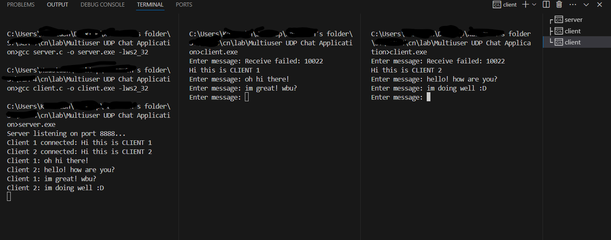

# "Write a program in C to implement Socket programming – multiuser UDP chat application"

## Basic setup
**THIS IS FOR WINDOWS ONLY**

Once you have cloned this repository, open vscode and then split your terminal into 3. There will be one for Server, one for Client 1 and one for Client 2.
There is cmds.txt file for all the cmds that you will need for the execution

## Commands to run :-
On the server terminal, use 
``` 
    gcc server.c -o server.exe -lws2_32 
    gcc client.c -o client.exe -lws2_32
    server.exe
```
On both, Client 1 and 2 terminals, use
``` 
    client.exe 
```
## Execution
Once this is done, you can type in the messages that you want to send from Client 1 and 2 on their respective terminals and then their messages will also be visible on server's terminal as well, indicating the successful execution of our chat program.




