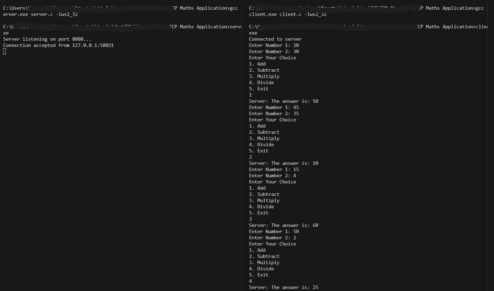

# "Write a C program for wired network using TCP socket to demonstrate basic mathematical operations."

## Basic setup
**THIS IS FOR WINDOWS ONLY**

Once you have cloned this repository, open vscode and then split your terminal into 2. There will be one for Server, and one for Client.
There is cmds.txt file for all the cmds that you will need for the execution

## Commands to run
On the server terminal, use 
``` 
    gcc -o server.exe server.c -lws2_32 
    server.exe
```
On the client terminal, use
``` 
    gcc client.c -o client.exe -lws2_32
    client.exe 
```
## Execution
Once this is done, you can enter 2 numbers and select the appropriate index for the operation that you wish to perform.


