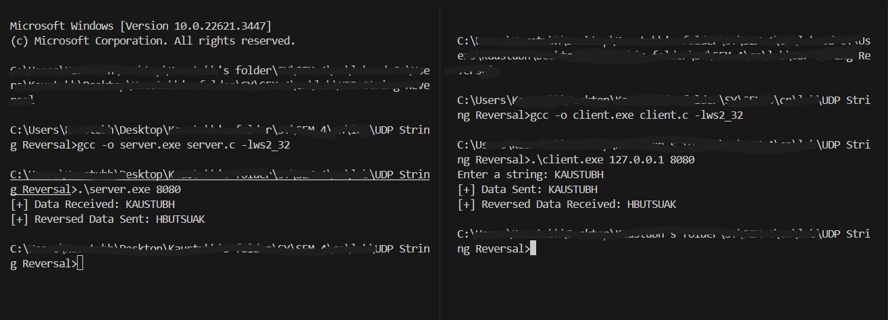

# "Write a C program for wired network using UDP socket to perform String Reversal."

## Basic setup
**THIS IS FOR WINDOWS ONLY**

Once you have cloned this repository, open vscode and then split your terminal into 2. There will be one for Server, and one for Client.
There is cmds.txt file for all the cmds that you will need for the execution

## Commands to run
On the server terminal, use 
``` 
    gcc -o server.exe server.c -lws2_32 
    .\server.exe 8080 
```
On both, Client 1 and 2 terminals, use
``` 
    gcc client.c -o client.exe -lws2_32
    .\client.exe 127.0.0.1 8080 
```
## Execution
Once this is done, you can enter a string and then you will see the reversed string as the output

